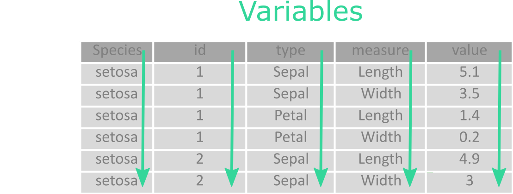
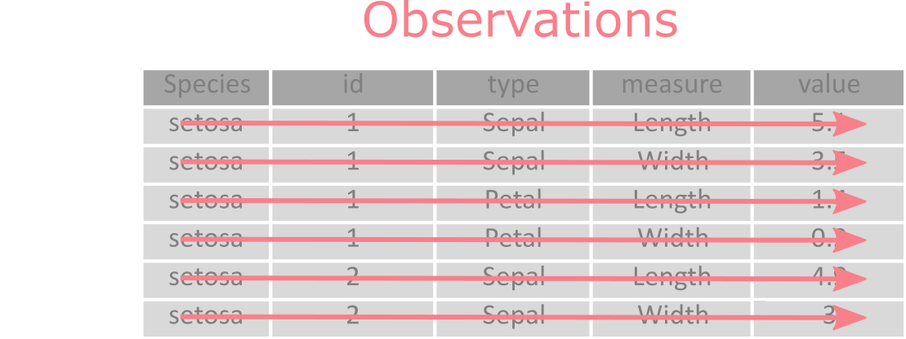
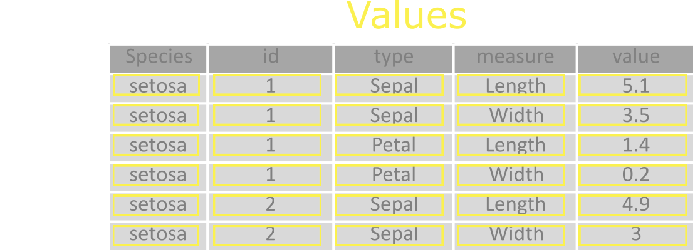

```{r setup, include=FALSE}
library(learnr)
library(naniar)
library(visdat)
library(dplyr)
library(outliers)
library(vtree)
library(tidyr)
library(skimr)
data(airquality)
knitr::opts_chunk$set(echo = FALSE)
tutorial_options(exercise.completion = TRUE)
load("data/iris_tidy.Rdata")
```

## [{#id .class width="100"}](https://tidyverse.tidyverse.org/) Tidyverse

-   Family of R packages created for data science.
-   Designed to work together to make common data science operations more user friendly.
-   Packages have the same design philosophy, grammar, and data structures.
-   R for data science

[{.class width="100"}](https://r4ds.hadley.nz/)

## What we mean by tidy datasets

-   Consistent data structure, easy to manipulate, model and visualize.
-   Designed to minimize effort on cleaning data to get it ready for analysis.
-   Data tidying = data conversion into tidy form.

Let's look at the following well known iris dataset, you can start by clicking **"Run"** in the interactive window below.

```{r iris, exercise = TRUE}
head(datasets::iris)
```


It's tidy form looks like this:

```{r iris_tidy, exercise = TRUE}
head(iris.tidy)
```


## Tidy data definition

### There are three interconnected rules that define tidy dataset:

1.  Each <mark style="background-color: #92D6BD">variable</mark> is a <mark style="background-color: #92D6BD">column</mark>; each column is a variable.

{.class width="500"}

2.  Each <mark style="background-color: #F7B0B6">observation</mark> is a <mark style="background-color: #F7B0B6">row</mark>; each row is an observation.

{.class width="500"}

3.  Each <mark style="background-color: #FBF595">value</mark> is a <mark style="background-color: #FBF595">cell</mark>; each cell is a single value.

{.class width="500"}


## Why it is useful to have tidy data

There are two main reasons to invest time and energy to convert data into tidy format:

1. Tidy format is used all across the tidyverse universe. This consistency makes it easier to manage the tools that work with the data. 
After that, it is possible to spend more time on data analysis itself, than fighting with the tools.

2. Tidy format is particularly well suited for vectorised programming languages like R, where most built-in functions work with vectors of values.

## How to tidy messy datasets

From the tidy data definition, it may seem that the requirements for the given format are completely natural and that most of the data, that you will come into contact with in data analysis, will be in such format. But the reality is quite often different. In general, there may be several problems: data is often collected for some other purpose than data analysis and their structure is based on the requirement that their collection (and not analysis) should be as simple as possible or that the most people in real world are not familiar with the principle of tidy data and therefore the tidy format will not be their first choice (or second).

This means that any analysis will require at least some initial effort to transform the original "messy" data to tidy format. The most used operation here will be the [pivoting](https://tidyr.tidyverse.org/articles/pivot.html).

### Lengthening data

Lets take a look at the previously mentioned famous iris dataset:  

```{r iris3, exercise = TRUE}
head(iris)
```
Here, each observation describes a flower. The first four columns it's sepal length and width and petal length and width, the last column than it's species. The first four column names in this dataset contain two variables:  leaf type (with values sepal and petal) and leaf measure (with values length and width).

The key to transform this dataset to it's tidy form is the function [`tidyr::pivot_longer()`](https://tidyr.tidyverse.org/reference/pivot_longer.html).
Additionally, You will need the function [`dplyr::mutate()`](https://dplyr.tidyverse.org/reference/mutate.html) to assign a unique identifier to individual flowers and the function [`tidyr::separate()`](https://tidyr.tidyverse.org/reference/separate.html) to split the variables type and measure.

```{r pivotlonger, exercise = TRUE}
iris.tidy <- iris |> 
  dplyr::mutate(id = 1:nrow(iris))
```

```{r pivotlonger-hint-1}
iris.tidy <- iris |> 
  dplyr::mutate(id = 1:nrow(iris)) |> 
  tidyr::pivot_longer(cols = 1:4)
```

```{r pivotlonger-solution}
iris.tidy <- iris |> 
  dplyr::mutate(id = 1:nrow(iris)) |> 
  tidyr::pivot_longer(cols = 1:4) |>
  tidyr::separate(col = "name",
                  into = c("type", "measure"))
head(iris.tidy)
```

What would happen if you forgot to use `separate` function ?

```{r pivotlonger2, exercise = TRUE}

```

### Widening data

The second commonly used function for data tidying is [`tidyr::pivot_wider()`](https://tidyr.tidyverse.org/reference/pivot_wider.html). It is the inverse transformation to `pivot_longer()`, it "widens" the data by increasing the number of columns and decreasing the number of rows.

```{r pivotwider, exercise = TRUE}
iris.tidy |> 
tidyr::pivot_wider(names_from = c("measure"),
                     values_from = "value")

```

## Exercises

The `tidyr::relig_income` dataset containes three variables: religion, income and frequency.

```{r religincome, exercise = TRUE}
relig_income
```

To tidy it, we need to pivot longer the non-variable columns into a two-column key-value pair.

```{r religincome2, exercise = TRUE}
relig_income |> 
```

```{r religincome2-solution}
relig_income |> 
  pivot_longer(-religion,
               names_to = "income",
               values_to = "frequency"
               )
```

The `tidyr::billboard` dataset records the billboard rank of songs in the year 2000.

```{r billboard, exercise = TRUE}
billboard
```

It has variables for artist, track, date.entered, rank and week. The rank in each week after it enters the top 100 is recorded in 75 columns, wk1 to wk76.
To tidy this dataset, we first use pivot_longer() to make the dataset longer. We transform the columns from wk1 to wk76, making a new column for their names, week, and a new value for their values, rank.
After that, it doesn't hurt to clean a little by converting the week variable to a number, and figuring out the date corresponding to each week on the charts:

```{r billboard2, exercise = TRUE}
billboard |> 
```

```{r billboard2-hint}
billboard |> 
  pivot_longer(
    wk1:wk76, 
    names_to = "week", 
    values_to = "rank", 
    values_drop_na = TRUE
  )
```

```{r billboard2-solution}
billboard |> 
  pivot_longer(
    wk1:wk76, 
    names_to = "week", 
    values_to = "rank", 
    values_drop_na = TRUE
  ) |> 
  mutate(
    week = as.integer(gsub("wk", "", week)),
    date = as.Date(date.entered) + 7 * (week - 1),
    date.entered = NULL
  )
```

## Why is the exploratory analysis important

### Purpose of exploratory data analysis

Basic exploratory analysis serves to:

-   uncover patterns, anomalies,
-   check the data consistency,
-   explore connection between variables,
-   produce assumptions, hypothesis,
-   understand data as a basis for modelling, predictions, etc.

### General truth about data sources

Companies tend to collect a lot of information, however often struggle in one or more of the following:

-   proper storage format,
-   proper collection workflow definition,
-   validation of the collectors,
-   ability to extract the data on demand,
-   documentation of the collected data,
-   unification of data across multiple sites/stations/etc.,
-   information extraction.

## Skimming through data

### First thing to do with a new dataset

When we get hands on a new data, the first thing we want to do is get a feeling how the data looks like.
At this moment we will assume we are working with tabular objects such as data.frame, data.table, or tibble as these are essential object in R data analysis.
It would be possible to extend some of the practices to the other data types, but these are not part of this course.

To check the data.frame we have many possibilities such as function `head()`, `summary()`, `str()`, `skimr::skim()`, `dplyr::glimpse()`.
Here we will focus on the `skim()` function from the [skimr](https://github.com/ropensci/skimr) package which provides the most information and great flexibility by making it possible to add Your own summary statistics.

### Skimr basics

Let's see the output of the `skim()` function on the \`riskfactors\`\` dataset provided with the [naniar](https://cran.r-project.org/web/packages/naniar/vignettes/getting-started-w-naniar.html) package.

```{r starwars_skim, exercise=TRUE, exercise.lines=2}
naniar::riskfactors |> 
  skimr::skim()
```

Among many pros of using `skim()` is that it returns a special form of data.frame containing columns `skim_type` and `skim_variable`.
The [skimr](https://github.com/ropensci/skimr) package is working very well with other packages from the [tidyverse](https://www.tidyverse.org) universe and with pipes.
That means that for example we can filter only the numeric variables with mean greater than 190 by calling `dplyr::filter(numeric.mean > 190)` on the results of `skim()`.

```{r riskfactors_filter, exercise=TRUE}
naniar::riskfactors |> 

```

```{r riskfactors_filter-hint}
naniar::riskfactors |> 
  skimr::skim() |> 
```

```{r riskfactors_filter-solution}
naniar::riskfactors |> 
  skimr::skim() |> 
  dplyr::filter(numeric.mean > 190)
```
### Skim group_by()

Another feature of the `skim()` is that it works with [dplyr](https://dplyr.tidyverse.org) grouping.
That way we can see the statistics across groups.
Of course it starts to get a little messy when there is many unique values in a groups, since this will create a (n-1)\*m rows, where n is original number of rows and m is number of unique values in a group.

```{r riskafactors_group_by, exercise=TRUE}
naniar::riskfactors |> 
  dplyr::select(state, sex, age, weight_lbs, height_inch, marital) |> 
  dplyr::group_by(sex) |> 
  skimr::skim()
```

### Customizing skim()

[skimr](https://github.com/ropensci/skimr) authors provided a number of statistics for basics datatypes.
However, there might be a time when we want to know something else.
This is possible by easy definition system for new statistics using `skimr::skim_with()` and `skimr::sfl()` functions.

```{r riskfactors_custom, exercise=TRUE}
my_skim <- skimr::skim_with(numeric = skimr::sfl(new_mad = ~mad(., na.rm = TRUE),
                                                 na_mad = ~mad(., na.rm = FALSE)),
                            append = FALSE)
naniar::riskfactors |> 
  dplyr::select(tidyselect::vars_select_helpers$where(is.numeric)) |> 
  my_skim()
```

<!-- ### Some things missing -->

<!-- [skimr](https://github.com/ropensci/skimr) provides many helper function when working with it. -->

<!-- Some examples are: -->

<!-- - Subsetting skimr_type using `skimr::yank()` -->

<!-- - Partitioning `skimr::skim()` output into multiple chunks with `skimr::partition()` -->

<!-- - Subsetting computed statistics with `skimr::focus()` -->

<!-- - Getting the skim info printed without changing the input data with `skimr::skim_tee()` -->

<!-- - Convert the `skim_df` object into the "long" output with `skimr::to_long()` -->

<!-- - Great number of other helper  functions in [skimr](https://github.com/ropensci/skimr) and [visdat](https://github.com/ropensci/visdat) packages. -->

## Missing observations

Another important factor happening a lot in any real world dataset are missing observations.
It is normal that these happens due to many different reasons such as not applicable answers in questionnaires, power failure in the measuring equipment, human error and many more.

Luckily there are specialized packages concerned with visualizing data and providing specialized plots to help the uncover different aspects of the missing data.
Here we will test two packages one is [visdat](https://github.com/ropensci/visdat) and the other is already mentioned [naniar](https://cran.r-project.org/web/packages/naniar/vignettes/getting-started-w-naniar.html) which uses [ggplot2](https://ggplot2.tidyverse.org).

In R the missing data are represented by NA.
Let's take a look on the distribution of NAs across the dataset with `visdat::vis_miss()` function.
This function shows the places where are the NAs in the dataset across individual variables and observations.
That way we can see, if there is somebody with tendency of not responding to the question in questionnaire, or whether there is a group of people who tends to not answer the same questions.

```{r visdat_missing, exercise = TRUE}
naniar::riskfactors |>
```

```{r visdat_missing-solution}
naniar::riskfactors |>
  visdat::vis_miss()
```

The next plot is very interesting plot, which visualizes the most prevalent combinations of NAs happening in the dataset.
This is `naniar::gg_miss_upset()` plot.
I like it very much as it visualize some very interesting relationships which might be difficult to find otherwise.

```{r missing_upset, exercise = TRUE}
naniar::riskfactors |>

```

```{r missing_upset-solution}
naniar::riskfactors |>
    naniar::gg_miss_upset(nsets = 15,
                        nintersects = 40)
```

Next we will take a look at a simple histogram of the number of missing observations across the variables using `naniar::gg_miss_var()`.

```{r missing_var_count, exercise = TRUE}
naniar::riskfactors |> 
```

```{r missing_var_count-solution}
naniar::riskfactors |> 
  naniar::gg_miss_var()
```

One very interesting way to look at the dataset is seeing how the NAs across variables are distributed across the groups of selected variable.
This is possible to see by the [naniar::gg_miss_fct()](https://naniar.njtierney.com/reference/gg_miss_fct.html) function, however there is one important caveat here, this function shows the percentage of NAs from the given group and that may lead to very misleading findings.
Let's see:

```{r missing_fct, exercise = TRUE}
naniar::riskfactors |> 
```

```{r missing_fct-solution}
naniar::riskfactors |> 
  naniar::gg_miss_fct(fct = marital)
```

There is also a possibility to visualize how many percent of the columns contain NAs for the given observations.
The `naniar::gg_miss_case` shows this and has also switches to order the cases by the amount of missing obsevations and to choose between absolute counts and percentage.

```{r missing_case, exercise = TRUE}
naniar::riskfactors |> 
```

```{r missing_case-solution}
naniar::riskfactors |> 
    naniar::gg_miss_case(order_cases = FALSE,
                         show_pct = TRUE)
```

Last plot about the missing observations we will go through is focused on the point plot.
Normally, when using [ggplot2](https://ggplot2.tidyverse.org) and running a `geom_point()` it will remove the NAs automatically.
[naniar](https://cran.r-project.org/web/packages/naniar/vignettes/getting-started-w-naniar.html) implemented the function where the missing observations are visualized as a -10% of the lowest value.
This can give an idea whether the missing observations miss for both variables, or only one.

```{r missing, exercise = TRUE}
naniar::riskfactors |>
```

```{r missing-solution}
naniar::riskfactors |>
  ggplot2::ggplot(ggplot2::aes(x = drink_days,
                               y = drink_average)) + 
  naniar::geom_miss_point()
```

## Outliers

When exploring the data, one of the very important parts is detecting the odd observations.
One type of such observation are called outliers.
These are observations which are very different than the rest.
One common with outliers is, that they do not have a clear definition.
Also, once detected it is important to understand the nature of these outliers.
Are they a mistake of measuring device, human error, or are they a real state if something which can happen, but is rare?
All of the above are possible.
In R there is a package called [outliers](https://cran.r-project.org/package=outliers) which contains the most used method of detecting outliers.

Here we will take try just two of them.
The first is called a z-score.
The definition can be found for example [here](https://articles.outlier.org/z-score-formula-examples-and-how-to-interpret).
The advantage of z-score is easy interpretation.
Also, if we consider that the data is normally distributed we can compute probabilities and quantile of the observation.

```{r z-score, exercise = TRUE}
naniar::riskfactors |>
```

```{r z-score-hint-1}
naniar::riskfactors |>
  dplyr::select_if(is.numeric) |>
```

```{r z-score-hint-2}
naniar::riskfactors |>
  dplyr::select_if(is.numeric) |>
  na.omit() |> 
```

```{r z-score-solution}
naniar::riskfactors |>
  dplyr::select_if(is.numeric) |>
  na.omit() |> 
  outliers::scores(type = "z")
```

The second approach we will test is [inter-quantile range](https://en.wikipedia.org/wiki/Interquartile_range) (IQR).
This method is actually used for the visualization of the box-plots.
The box is a range from first to third quantile, the line in the box is median, whiskers are observations which are at most 1.5 times the IQR.
Finally, the dots are the outliers.
To have a clear view of this, we will use `starwars` dataset from the [dplyr](https://dplyr.tidyverse.org) package.

First the boxplot `geom_boxplot()` in [ggplot2](https://ggplot2.tidyverse.org) package

```{r boxplot, exercise = TRUE}
dplyr::starwars |> 
```

```{r boxplot-solution}
dplyr::starwars |> 
  ggplot2::ggplot(ggplot2::aes(y = birth_year)) +
  ggplot2::geom_boxplot()
```

and then also the [outliers](https://cran.r-project.org/package=outliers) package `scores()` function with a type "iqr" and limit (variable `lim`) 1.5.

```{r iqr, exercise = TRUE}
dplyr::starwars$birth_year |> 
```

```{r iqr-hint}
dplyr::starwars$birth_year |> 
  na.omit() |> 
```

```{r iqr-solution}
dplyr::starwars$birth_year |> 
  na.omit() |> 
  outliers::scores(type = "iqr",
                   lim = 1.5) 
```

One last note, the above mentioned methods work with univariate variables.
For the multivariate variables a very simple, but well working algorithm is for example [DBSCAN](https://en.wikipedia.org/wiki/DBSCAN).

## Variable trees

Variable trees are a new method for the exploration of discrete multivariate data. It is a flexible tool for calculating and displaying diagrams that show information about nested subsets of a data frame. They can be used to explore a data set interactively
and produce customized figures for reports and publications.

A tree with two variables contains similar information to a two-way contingency table, but it becomes significantly more interesting for visualization and summary of more variables.

Let's take a look at build-in dataset that might contain for example data about some medical study:

```{r vtrees1, exercise = TRUE}
head (vtree::FakeData)
```

The [`vtree::vtree()`](https://www.rdocumentation.org/packages/vtree/versions/5.6.5/topics/vtree) function provides an exhaustive amount of visualization options:

```{r vtrees2, exercise = TRUE}
vtree(FakeData,
      "Group Sex Severity",
      title = "People",
      showlegend = TRUE,
      shownodelabels = FALSE)
```

The main advantages of this approach are the minimization of possible errors caused by the manual calculation of all necessary summary statistics and it's reproducibility when a revised tree can be automatically produced for the updated dataset.

## Exercises {data-progressive="FALSE"}

Now here is a part for some hands-on to reinforce what we have learned.
We will work with the airquality dataset.
You are free to use the interactive window below to find out answers to the quiz questions under it.

```{r airquality, exercise = TRUE}
airquality |> 
    skimr::skim()
```

```{r quiz}
quiz(
  question("Which of these variables contain missing observations?",
    answer("Ozone", correct = TRUE),
    answer("Temp"),
    answer("Solar.R", correct = TRUE),
    answer("Wind")
  ),
  question("How many observations are missing in multiple variables?",
    answer("none"),
    answer("one"),
    answer("two", correct = TRUE),
    answer("five")
  ),
  question("How many outliers are in the airquality dataset for the z-score with threshold of 3?",
    answer("none"),
    answer("one"),
    answer("two", correct = TRUE),
    answer("five")
  ),
  question("In which month was the highest median of Ozone and in which month it was highest mean?",
    answer("8 and 9"),
    answer("6 and 7"),
    answer("7 and 8", correct = TRUE))
)
```

For more fun I recommend taking a look at `starwars` dataset from [dplyr](https://dplyr.tidyverse.org).


## Cheatsheet

#### tidyr

-   [pivot_longer()](https://tidyr.tidyverse.org/reference/pivot_longer.html) - "lengthens" data, increasing the number of rows and decreasing the number of columns
-   [pivot_wider()](https://tidyr.tidyverse.org/reference/pivot_wider.html) - "widens" data, increasing the number of columns and decreasing the number of rows
-   [separate()](https://tidyr.tidyverse.org/reference/separate.html) - separates a character column into multiple columns with a regular expression or numeric locations

#### dplyr

-   [mutate()](https://dplyr.tidyverse.org/reference/mutate.html) - creates, modifies, and deletes columns
-   [select()](https://dplyr.tidyverse.org/reference/select.html) - keeps or drops columns using their names and types
-   [filter()](https://dplyr.tidyverse.org/reference/select.html) - keeps or drops columns using their names and types
-   [summarize()](https://dplyr.tidyverse.org/reference/select.html) - keeps or drops columns using their names and types
-   [arrange()](https://dplyr.tidyverse.org/reference/arrange.html) - orders rows using column values

#### skimr

-   [skim()](https://www.rdocumentation.org/packages/skimr/versions/1.0.3/topics/skim) - the overall statistics of the dataset
-   [skim_with()](https://www.rdocumentation.org/packages/skimr/versions/2.1.5/topics/skim_with) - customize the skim function
-   [sfl()](https://www.rdocumentation.org/packages/skimr/versions/2.1.5/topics/sfl) - define custom statistic

#### visdat

-   [vis_miss()](https://www.rdocumentation.org/packages/visdat/versions/0.6.0/topics/vis_miss) - visualize missing observation in data

#### naniar

-   [gg_miss_upset()](https://naniar.njtierney.com/reference/gg_miss_upset.html) - visualize count of combinations of missing observations
-   [gg_miss_var()](https://naniar.njtierney.com/reference/gg_miss_var.html) - histogram of missing observations
-   [gg_miss_fct()](https://naniar.njtierney.com/reference/gg_miss_fct.html)  - percentage of missing observations for individual levels of factor
-   [gg_miss_case()](https://naniar.njtierney.com/reference/gg_miss_case.html) - number of missing cases across observations

#### outliers

-   [scores()](https://www.rdocumentation.org/packages/outliers/versions/0.15/topics/scores)  - different score functions from outliers package

#### vtree

-   [vtree()](https://www.rdocumentation.org/packages/vtree/versions/5.6.5/topics/vtree)  - function for exploration and visualization of discrete multivariate data

## Useful resources

I found inspiration, or plainly used the same examples as are on other sites and would like to use this place to link them here.
(I deeply apologize to all the ones I might have forgotten about.) Most of them contain much more details about individual parts that were covered by this short tutorial.

-   skimr github - <https://github.com/ropensci/skimr>
-   visdat github - <https://github.com/ropensci/visdat>
-   naniar Vignette - <https://cran.r-project.org/web/packages/naniar/vignettes/getting-started-w-naniar.html>
-   Nicholas Tierney's [Gallery of Missing Data Visualisations](https://naniar.njtierney.com/articles/naniar-visualisation.html#gg_miss_which)
-   outliers CRAN page - <https://cran.r-project.org/package=outliers>
-   ggplot2 page - <https://ggplot2.tidyverse.org>
-   dplyr page - <https://dplyr.tidyverse.org>
-   z-score page - <https://articles.outlier.org/z-score-formula-examples-and-how-to-interpret>
-   IQR page - <https://en.wikipedia.org/wiki/Interquartile_range>
-   DBSCAB page - <https://en.wikipedia.org/wiki/DBSCAN>
-   vtree page <https://cran.r-project.org/web/packages/vtree/vignettes/vtree.html>
