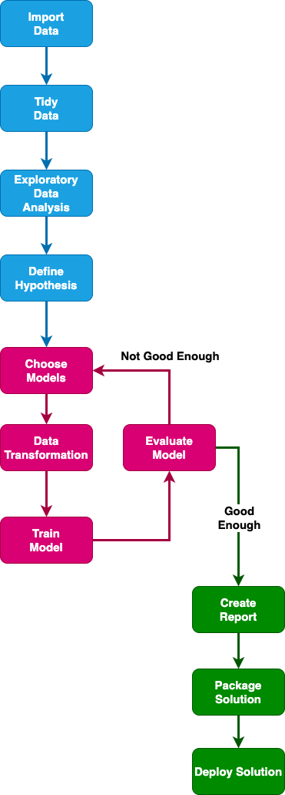
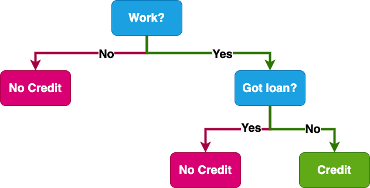
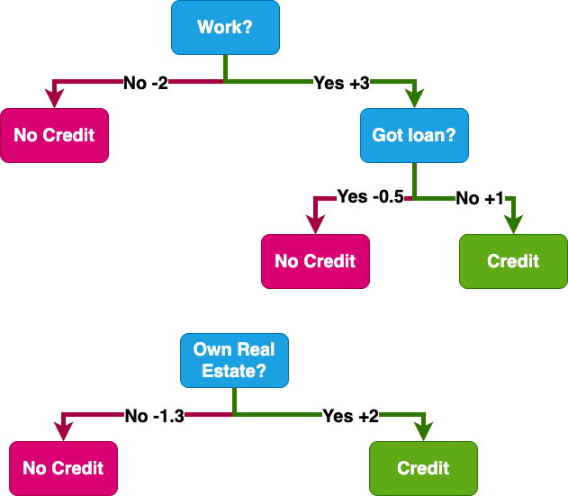
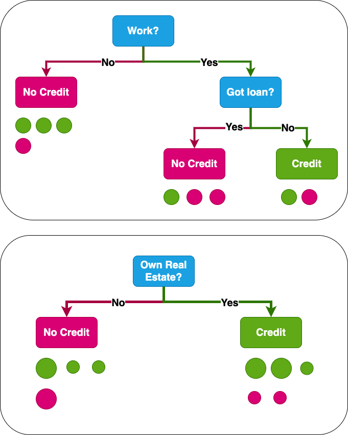

```{r setup, include=FALSE}
library(learnr)
library(ranger)
library(randomForest)
library(xgboost)
library(modeldata)
library(tidymodels)
knitr::opts_chunk$set(echo = FALSE)
tutorial_options(exercise.completion = TRUE)
ggplot2::theme_set(ggplot2::theme_bw())
```
<!-- ## Content of this training -->

<!-- -   [Goals of this training](#goals-of-this-training) -->
<!-- -   [Types of Models](#types-of-models) -->
<!-- -   [Modeling workflow](#modeling-workflow) -->
<!-- -   [Tidymodels](#tidymodels) -->
<!-- -   [XGBoost](#xgboost) -->
<!-- -   [Data preprocessing](#data-preprocessing) -->
<!-- -   Ames dataset -->
<!-- -   Creating a training and testing dataset with rsample -->
<!-- -   Data transformation pipeline with recipes -->
<!-- -   Define model training with parsnip -->
<!-- -   Prediction and comparison with yardstick -->
<!-- -   Multiple models example with k-means -->
<!-- -   Cheatsheet -->
<!-- -   Exercise -->
<!-- -   Useful resources -->

## Goals of this training

1. Establish generic modeling workflow.
2. Learn to use [recipes](https://recipes.tidymodels.org) package for reproducible data preprocessing definition.
3. Define model parameters with [parsnip](https://parsnip.tidymodels.org).
4. Evaluate model performance using [yardstick](https://yardstick.tidymodels.org).
5. Get to know how to handle multiple models in tidy format with [workflowsets](https://workflowsets.tidymodels.org).
6. Reinforce

Note: This training is second from the two connected trainings presented at [High Performance Data Analysis with R](https://events.it4i.cz/event/163/overview)

You can find the first training [here](shiny.vsb.cz) under the name training_eda_april_2023.

## Types of Models

There are multiple ways we could talk about the models types. The first one we will introduce in this training are taken from the book [Tidy Modeling with R](https://www.tmwr.org/) where You can also find examples. 

### Descriptive Models

The main aim of the of descriptive models is, as the name suggests, to describe or illustrate some characteristic of data. This may even be a visualization which shows some trend, or feature of data. We could say that large part of the `Exploratory Data Analysis` (EDA) falls into this category.

### Inferential Models

Inferential models are used to answer some kind of research question or to explore specific hypothesis. This may be for example determining efficiency of a new treatment, or determining sensitivity of certain variables on the outcome of an experiment.
Important factor in inferential models are the assumptions about the model, for example when we assume the time series is stationary.

### Predictive Models

Most likely the best known type is predictive modeling, where we are trying to create a model which can accurately predict values when given new data. This may be prediction of sales, energy consumption, survivability of certain species in given conditions, or detection of cat in a picture.

### Models division based on the amount of supervision of the model

The second way we will divide the models is whether we are directing the model to concrete results by pretty much showing it solution to the problem or not.
In this case one group of models is supervised, other is unsupervised and there are several approaches in between for example semi-supervised and reinforced learning.

The supervised models are for example linear regression, support vector machine, decision trees, or some types of neural networks.
The main characteristic of these models is a part of data which is labelled with a correct output of a model and model is making use of such information during its training/fitting.

In case of unsupervised models the model there are no such data and it tries to naturally find the best solution to the problem. Such models are for example k-nearest neighbours clusterin, self-organizing maps, principal component analysis or autoencoders.

In between these is reinforced learning with model knowing only the score of its output, or semi-supervised learning where only portion of the data is labelled with correct answer.

## Modeling Workflow

Depending on a person You're talking to You would get different answer about how their modeling workflow, or lifecycle looks like.

Here we will try to define one that is focused mostly on delivering the solution to the customers and is composed of:

1. Data import
2. Tidying data
3. Exploratory data analysis
4. Define hypothesis/goals
5. Choose the most suitable models
6. Define model specific data transformation
7. Train model
8. Evaluate model performance
9. Repeat with other models or hyperparameter settings
10. Tracking different models performance
11. Select best models
12. Explain the results
13. Package solution
14. Deploy solution

Since this is not completely a linear process we will use a visualization to make it more realistic.




## Tidymodels

Tidymodels are a set of packages that cover most of the stages of the modeling. They are using tidy objects and work very well with each other helping with preprocessing, model definition, model tuning and evaluation.

### Tidymodels packages

At the time of writing the core packages are:

{#id .class width=90}
for sampling the data. [rsample](https://rsample.tidymodels.org/)

{#id .class width=90}
to create reproducible data preprocessing pipeline. [recipes](https://recipes.tidymodels.org/)

{#id .class width=90}
to define models. [parsnip](https://parsnip.tidymodels.org/)

{#id .class width=90}
provides performance metrics for models. [yardstick](https://yardstick.tidymodels.org/)

{#id .class width=90}
to package everything into on object. [workflows](https://workflows.tidymodels.org/)

{#id .class width=90}
converts information in common statistical R objects into user-friendly format. [broom](https://broom.tidymodels.org/)

{#id .class width=90}
for optimizing the hyperparameters of model and preprocessing steps. [tune](https://tune.tidymodels.org/)

{#id .class width=90}
creates and manages tuning parameters and parameter grids. [dials](https://dials.tidymodels.org/)
[dials](https://dials.tidymodels.org/) is used to describe the space which should be explored by [tune](https://tune.tidymodels.org/) package when optimizing hyperparameters.

There is also a number of specialized packages which can be found at [tidymodels](https://www.tidymodels.org/packages/) page.

Note: Logos are direct links from the [tidymodels](https://www.tidymodels.org/packages/) website.

## XGBoost

[](https://xgboost.readthedocs.io/en/stable/index.html) is a library with highly efficient implementation of a parallel tree boosting. It is available in many different programming languages and also compatible with many different frameworks for distributed learning such as Spark, Dask, Ray and more. It is possible to use it also with GPU and most notably for multi-GPU multi-node learning, thus allowing for solving extremely large problems very fast.

One thing that we need to keep in mind when using XGBoost is that currently it cannot handle non-numerical values (factors), therefore we need to preprocess such values by the technique called one-hot encoding. We will get to this later while creating data transformation pipeline.

### Decision trees

Since [](https://xgboost.readthedocs.io/en/stable/index.html) is a composed of decision trees we will have a quick look at how decision trees work.
We can describe single decision tree as a set of if-else statements, where at the final leaf we will get some kind of results.
Depending on whether it is regression or classification we will get either some numerical output related to the regression or a label.

How such a decision tree looks like is shown in the following figure:




### Boosting trees

Now let's imagine that we have multiple decision trees called decision tree ensemble.
Ensemble decision trees use a set of classification and regression trees (CART).
In such models each leaf stores not just the decision, but also a score which is then helpful when computing the ensemble model loss.

We can imagine how this work from the next figure, where there are two decision trees:



In this case the score given to the result is a sum of all the scores for given observation through all the tress.

Random forest is an ensemble of multiple decision trees which may be created at random with different features.
The main difference between random forest and boosted trees is that in boosted trees the subsequent trees are taking into account which observations were classified incorrectly in previous tree.
That means they will have greater weight when computing the loss for the next tree, since we want to be able to create a tree which is able to classify them correctly.

How this works is shown in the next figure:



If You are interested in learning more about decision trees, You can start here:
- [XGBoost introduction to Boosted Trees](https://xgboost.readthedocs.io/en/stable/tutorials/model.html)
- [Modeling Data with R](https://cod.pressbooks.pub/modelingdatawithr/)

## Data preprocessing

The first thing before modeling is to prepare data into tidy format, explore the data, understand them and then prepare a data transformation pipeline.
It is important to note that the data transformation depends heavily on the models we are going to use.
Each model have different characteristics, and while some can handle NA values, or correlated variables, others cannot.
Therefore, it is good to understands the strengths and weaknesses of each model and adjust preprocessing routine accordingly.

### Data preprocessing

The data preprocessing is at least in my opinion a stage, where we are trying to get the data into the format which at the end will be used for the partitioning into the training and holdout set.

- Tidy the data.
- Creating training, validation and test (holdout) sets.

### Data transformation

- Removing zero- and near zero-variance Variables
- Remove correlated variables
- Remove linear dependencies
- Center and scale the variables
- Impute missing observations
- Dimensionality reduction
- One-hot encoding (Dummy variables creation).

In tidy universe there are three main phases of data preprocessing for model training:

1. Clean data mainly using [tidyr]() and [dplyr]() packages.
2. Setup data samples for the modelling with [rsample]().
3. Create reproducible data adjustment pipeline using the [recipes](https://recipes.tidymodels.org).

It is important to note, that if we want to test model on new data from the same source we will need to repeat step 1. and 3. for prediction. While we will learn how to put 3. into the workflow, we will need to keep track of 1. ourselves.

## Ames dataset

For the next part of this tutorial we will use Ames housing dataset [De Cock 2011][https://doi.org/10.1080/10691898.2011.11889627].
We will use tidied version of the dataset from the [modeldata](https://modeldata.tidymodels.org) package. 
If somebody is curious about original dataset it can be found in the packages [AmesHousing](https://github.com/topepo/AmesHousing).

This dataset contains 74 variables from 2930 with description of properties in Ames, Iowa.
Columns of the dataset contain information about:

- house characteristics such as number of bedrooms, garage, pool, etc.
- location,
- lot information,
- ratings of condition and quality,
- sale price.

Now we will take a look at dataset itself.
```{r skim-setup}
data(ames)
```

```{r skim, exercise = TRUE}
skimr::skim(ames)
```

```{r housing-setup}
data(ames)
```

```{r housing, exercise = TRUE}
ggplot(ames, aes(x = Sale_Price)) +
  geom_histogram(bins = 50,
                 col = "white")
```

## Creating a training and testing dataset with rsample

Since the dataset is already prepared for the modelling we will focus on creation of the training and holdout sets.
Anyway, there are many other operations that can be made on the data before learning the model, but most of these is best to be done as part of the resampling of the data during the learning.
The reasoning behind this is, that it is necessary to handle the data as in real world case and that means, that any of the operations on the data should be done directly on the subsamples used for training the model, otherwise we would affect also the test data, or holdout data by such transformations and vice versa the training data would be affected also by the knowledge contained in the test data or holdout data.
The caret package stores the values for the transformations done on the training data such as centering, scaling, pca, etc.
This way the transformation done on the test data and holdout set is the same as on the training data.

Another important aspect to be considered when creating the training and holdout sets is that often the distribution of classes is not symmetrical.
Therefore it is good to make the subsamples in such a way, that the distribution of classes in the training set and holdout set is approximately the same.
Luckily, the function ```rsample::initial_split``` have parameter called `strata` which takes name of the column as input and then returned indices are keep the distribution of the classes among the training and testing set, or as in case of Ames dataset where price is numeric it is binned into quartiles.
This behaviour can be overriden by argument `breaks` which takes single number as input indicating the number of bins for stratification.
Another important argument is `prop` which determines the ratio of the training and test part of the dataset.

After data split is assigned to the variable we can extract training and testing part from it by calling functions `training()` and `testing()` respectively.

Now let's try to create training and testing sets from the Ames housing dataset with function `initial_split` with setting strata to "Sale_Price" and prop to 0.7.
Then we will training set to variable `ames_train` and testing set to `ames_test`.
First part of the exercise is prepared.
Also we will use log of the `Sale_Price`, because its distribution is a little bit better and effect of very expensive houses is somewhat normalized.
We do it at this point, because when we use recipe later it does not play well with editing explained variable, since it is not available during prediction.

```{r ames_split_data-setup}
data(ames)
```

```{r ames_split_data, exercise = TRUE}
set.seed(4595)
data_split <- ames |> 
  mutate(Sale_Price = log(Sale_Price)) |> 
  initial_split()
```

```{r ames_split_data-hint-1}
set.seed(4595)
data_split <-  ames |> 
  mutate(Sale_Price = log(Sale_Price)) |> 
  initial_split(strata = "Sale_Price",
                prop = 0.7)
```

```{r ames_split_data-hint-2}
set.seed(4595)
data_split <-  ames |> 
  mutate(Sale_Price = log(Sale_Price)) |> 
  initial_split(strata = "Sale_Price",
                prop = 0.7)

ames_train <- training(data_split)
```

```{r ames_split_data-solution}
set.seed(4595)
data_split <-  ames |> 
  mutate(Sale_Price = log(Sale_Price)) |> 
  initial_split(strata = "Sale_Price",
                prop = 0.7)

ames_train <- training(data_split)
ames_test  <- testing(data_split)
```

```{r ames_split_data-solved}
set.seed(4595)
data_split <-  ames |> 
  mutate(Sale_Price = log(Sale_Price)) |> 
  initial_split(strata = "Sale_Price",
                prop = 0.7)

ames_train <- training(data_split)
ames_test  <- testing(data_split)
```
## Data transformation pipeline with recipes

We will use [recipes](https://recipes.tidymodels.org) package to define the transformations that should be made on the data.
Here we will have only four different step to adjust data before putting them into model.
One last operation will be computation of the estimate of the means and standard deviations with function `prep()`.
This is important since later we can use function `bake()` to do the exact same operation on another datasets (test set).

1. We will combine rare factors into one other called other for the `Neighborhood` using function `step_other()`.
2. Create dummy variables for the nominal variables by calling function `step_dummy()` on all the nominal variables using `all_nominal()` function.
3. Center all the numeric predictors with `step_center()` and `all_numeric_predictors`.
4. Normalize all the numeric predictors with `step_scale()` and `all_numeric_predictors`.

The exercise will have recipe prepared.
Notice that the recipe already contains formula for the model and data filled out.
The convenience of using [recipes](https://recipes.tidymodels.org) and [parsnip](https://parsnip.tidymodels.org) is that even models which does not accept formula notation will work with the formula notation in recipe.

```{r recipes, exercise = TRUE, exercise.setup = "ames_split_data-solved"}
norm_recipe <- 
  recipe(
    Sale_Price ~ Longitude + Latitude + Lot_Area + Neighborhood + Year_Sold, 
    data = ames_train
  )
```

```{r recipes-hint-1}
norm_recipe <- 
  recipe(
    Sale_Price ~ Longitude + Latitude + Lot_Area + Neighborhood + Year_Sold, 
    data = ames_train
  ) %>%
  step_other(Neighborhood) %>% 
  step_dummy(all_nominal())
```

```{r recipes-hint-2}
norm_recipe <- 
  recipe(
    Sale_Price ~ Longitude + Latitude + Lot_Area + Neighborhood + Year_Sold, 
    data = ames_train
  ) %>%
  step_other(Neighborhood) %>% 
  step_dummy(all_nominal()) %>%
  step_center(all_predictors()) %>%
  step_scale(all_predictors()) %>%
```

```{r recipes-solution}
norm_recipe <- 
  recipe(
    Sale_Price ~ Longitude + Latitude + Lot_Area + Neighborhood + Year_Sold, 
    data = ames_train
  ) %>%
  step_other(Neighborhood) %>% 
  step_dummy(all_nominal()) %>%
  step_center(all_predictors()) %>%
  step_scale(all_predictors())
```

```{r recipes-solved, exercise.setup = "ames_split_data-solved"}
norm_recipe <- 
  recipe(
    Sale_Price ~ Longitude + Latitude + Lot_Area + Neighborhood + Year_Sold, 
    data = ames_train
  ) %>%
  step_other(Neighborhood) %>% 
  step_dummy(all_nominal()) %>%
  step_center(all_predictors()) %>%
  step_scale(all_predictors())
```

Now we call function `prep()` on `norm_recipe` with argument `training` equal `ames_train` and argument `retain` equal `TRUE`.
This will train the recipe on the `ames_train` data.

```{r recipes-prep, exercise = TRUE, exercise.setup = "recipes-solved"}
norm_recipe_prep <- 
  norm_recipe
```

```{r recipes-prep-solution}
norm_recipe_prep <- 
  norm_recipe |> 
  prep(training = ames_train, retain = TRUE)
```

```{r recipes-prep-solved, exercise.setup = "recipes-solved"}
norm_recipe_prep <- 
  norm_recipe |> 
  prep(training = ames_train, retain = TRUE)
```

In the next window You can explore the `norm_recipe` and `norm_recipe_prep` a little bit more.
Very interesting elements are `norm_recipe$var_info` and `norm_recipe$term_info` which gives You information about variables coming into the recipe and variables coming out of the recipe after using `bake()` on data.
One can also look at the `norm_recipe$steps` to see more information about steps, especially after the recipe was trained by calling `prep()`.
However, this is not really meant to be explored and is difficult to read.

```{r recipe_playground, exercise = TRUE, exercise.setup = "recipes-prep-solved"}
norm_recipe_prep
```

### Note

[recipes](https://recipes.tidymodels.org) contains many more functions.
Among them are also imputation of values for the NAs or removing of the variables with zero variance.
Another thing that the [recipes](https://recipes.tidymodels.org) can do is add roles to variables. 
That way some of the variables does not need to be used during training, but may be used to check the predictive ability in deeper way.
We will not cover this part in this training, but You can learn more about this on the [recipes](https://recipes.tidymodels.org) package [Get started](https://www.tidymodels.org/start/recipes/#recipe) pages.
Another thing that may be interesting and it is not covered here is handling of unbalanced datasets. 
These may be for example medical datasets containing observations for a rare disease.
In such a case we will have a lot of observation of healthy patients and very few diseased patients.
Then many models have tendency to provide very bad fit, since the imbalance in labels will overestimate the models accuracy.
Possible handling of such cases may be subsampling the data or oversampling by creating artificial data for the rare labels.
Package [themis](https://github.com/tidymodels/themis) provides functions that can be used as steps in recipes to do just that.

## Define model training with parsnip

Finally, we will train model itself.
In this training we will take a look at tree approaches of how to use [parsnip](https://parsnip.tidymodels.org) to train the model and make prediction.
First we will start by defining the model and fitting it without using recipe.
Then we will continue by using recipe and lastly we will use [workflow](https://workflow.tidymodels.org) package to put everything together into workflow.

### Train model without recipe

For the first example we will use random forest model from the package [ranger](https://github.com/imbs-hl/ranger).
With parsnip we first need to create model specification.
Advantage of having specification without data will become obvious when we put everything into workflow.
To initialize random forest model we use function `rand_forst()`.
In case of random forest model and also boosting trees it is important to define the mode of the model.
For random forest it can be either `regression` or `classification`.
We will use `regression` now.
We may also set the engine of the model, although it is not necessary, we can put `ranger` to the parameter engine.
At this stage, we can also add some other parameters related to the random forest models, but we will skip that for now.
To get list of possible parameters call `?rand_forest` in the console.
R help works also in the [learnr](https://rstudio.github.io/learnr/) environment.

```{r ranger, exercise = TRUE, exercise.setup = "recipes-prep-solved"}
rf_spec <- 
  rand_forest(mode = "regression")
```

```{r ranger-solution}
rf_spec <- 
  rand_forest(mode = "regression",
              engine = "ranger")
```

```{r ranger-solved, exercise.setup = "recipes-prep-solved"}
rf_spec <- 
  rand_forest(mode = "regression",
              engine = "ranger")
```

When we have model specification defined, we can fit the model.
To fit the model we simply may called function `fit` on the model specification object `rf_spec`, define the formula for fitting the model and add data into `data` parameter.
For now we will use following formula `Sale_Price ~ Longitude + Latitude + Lot_Area + Neighborhood + Year_Sold` and data `ames_train`.
This will make use of the same data as the recipe `norm_recipe`.
At the end of the model training section will be left one chunk to explore all the created models.

```{r ranger_fit, exercise = TRUE, exercise.setup = "ranger-solved"}
rf_fit <- 
  rf_spec
```

```{r ranger_fit-solution}
rf_fit <- 
  rf_spec |> 
  fit(
    Sale_Price ~ Longitude + Latitude + Lot_Area + Neighborhood + Year_Sold,
    data = ames_train
  )
```

```{r ranger_fit-solved, exercise.setup = "ranger-solved"}
rf_fit <- 
  rf_spec |> 
  fit(
    Sale_Price ~ Longitude + Latitude + Lot_Area + Neighborhood + Year_Sold,
    data = ames_train
  )
```

### Train model with recipe

Now we will train model using recipe.
This time we will use boosting tree model XGBoost.
That means instead of `rand_forest` we will use function `boost_tree`, the mode will be again `regression` and engine will be `xgboost`.

```{r xgboost, exercise = TRUE, exercise.setup = "ranger_fit-solved"}
xgb_spec <- 
```

```{r xgboost-hint-1}
xgb_spec <- 
  boost_tree(mode = "regression")
```

```{r xgboost-solution}
xgb_spec <- 
  boost_tree(mode = "regression",
             engine = "xgboost")
```

```{r xgboost-solved, exercise.setup = "ranger_fit-solved"}
xgb_spec <- 
  boost_tree(mode = "regression",
             engine = "xgboost")
```

Now when we have the model specification we will fit the model.
Once again we will use the function `fit()` to do this, but there will be some changes.
Since the data will be preprocessed by the recipe, we can make the formula shorter: `Sale_Price ~ .`.
Dot on the right hand side of the formula means it will take all the data except `Sale_Price` as the right hand side.
Into data argument of the we need to put the transformed data, to do that we need to call function `bake()` on the `norm_recipe_prep` variable and also add `NULL` to the argument `new_data`.
Notice we need to use the trained recipe, otherwise it would be impossible to `bake()` it.
Let's try to fit the model now.

```{r xgboost_fit, exercise = TRUE, exercise.setup = "xgboost-solved"}
xgb_fit <-
```

```{r xgboost_fit-hint-1}
xgb_fit <- 
  xgb_spec
```

```{r xgboost_fit-hint-2}
xgb_fit <- 
  xgb_spec |> 
  fit(Sale_Price ~ .)
```

```{r xgboost_fit-solution}
xgb_fit <- 
  xgb_spec |> 
  fit(Sale_Price ~ ., 
      data = bake(norm_recipe_prep, new_data = NULL))
```

```{r xgboost_fit-solved, exercise.setup = "xgboost-solved"}
xgb_fit <- 
  xgb_spec |> 
  fit(Sale_Price ~ ., 
      data = bake(norm_recipe_prep, new_data = NULL))
```


### Train the model as a workflow

The last solution is to use `workflow()` from the [workflow](https://workflows.tidymodels.org) package.
To do that we will call function `workflow` and then pipe on it function `add_model()` where we will put the model specification (`xgb_spec`) and to that we will pipe `add_recipe()` where we will put untrained recipe `norm_recipe`.
This will prepare the workflow specification, similar to the recipe and workflow specification.
If one wants to change some part of the workflow, it is possible to remove each component and then add a new one.
One thing we will not cover here, but is very useful is adding tuning parameters into the workflow, therefore creating the hyperparameter tuning workflow.

```{r workflow, exercise = TRUE, exercise.setup = "xgboost_fit-solved"}
xgb_workflow <-
```

```{r workflow-hint-1}
xgb_workflow <- 
  workflow()
```

```{r workflow-hint-2}
xgb_workflow <- 
  workflow() |> 
  add_model(xgb_spec)
```

```{r workflow-solution}
xgb_workflow <- 
  workflow() |> 
  add_model(xgb_spec) |> 
  add_recipe(norm_recipe)
```

```{r workflow-solved, exercise.setup = "xgboost_fit-solved"}
xgb_workflow <- 
  workflow() |> 
  add_model(xgb_spec) |> 
  add_recipe(norm_recipe)
```

Now to fit the workflow we can call the `fit()` function and only define `data` argument of the function.
Workflow will take care of prepping and baking the data for example.
That is really convenient and we will see how that also helps when making predictions.
Let's try fitting created workflow with `ames_train` data.

```{r workflow_fit, exercise = TRUE, exercise.setup = "workflow-solved"}
xgb_workflow_fit <- 
```

```{r workflow_fit-solution}
xgb_workflow_fit <- 
  xgb_workflow |> 
  fit(data = ames_train)
```

```{r workflow_fit-solved, exercise.setup = "workflow-solved"}
xgb_workflow_fit <- 
  xgb_workflow |> 
  fit(data = ames_train)
```

Here is an empty chunk, where we can explore created models.
Try to call `rf_fit`, `xgb_fit`, `xgb_workflow_fit` variables.

```{r workflow_playground, exercise = TRUE, exercise.setup = "workflow_fit-solved"}

```

## Prediction

Now when we have models trained we will make prediction on the test part of the dataset.
Once again we will go through three variants based on the way the model was specified and trained.
To make a prediction on our random forest model we will just call function `predict()` on the object `rf_fit` with argument `new_data` equal `ames_test`.
This will create a data frame with a column .pred containing predicted values.

```{r ranger_prediction, exercise = TRUE, exercise.setup = "workflow_fit-solved"}
rf_pred <-  
```

```{r ranger_prediction-hint-1}
rf_pred <-  
  rf_fit
```

```{r ranger_prediction-solution}
rf_pred <-  
  rf_fit |>
  predict(new_data = ames_test)
```

```{r ranger_prediction-solved, exercise.setup = "workflow_fit-solved"}
rf_pred <-  
  rf_fit |>
  predict(new_data = ames_test)
```

In case of our boosted tree model which used recipe we will first need to `bake()` the test data and then put them into the `predict()` function.
That will ensure that the data used for the prediction has the same format as the data used for the training.
For the `bake()` part we will use `norm_recipe_prep` and put `ames_test` into the argument `new_data`.
Then we we will use this transformed data in the prediction.
Result will be the same type of data frame as in previous case.

```{r xgb_prediction, exercise = TRUE, exercise.setup = "ranger_prediction-solved"}
ames_test_baked <-

xgb_pred <- 
```

```{r xgb_prediction-hint-1}
ames_test_baked <- bake(norm_recipe_prep,
                        new_data = ames_test)

xgb_pred <- 
```

```{r xgb_prediction-solution}
ames_test_baked <- bake(norm_recipe_prep,
                        new_data = ames_test)

xgb_pred <- 
  xgb_fit |> 
  predict(new_data = ames_test_baked)
```

```{r xgb_prediction-solved, exercise.setup = "ranger_prediction-solved"}
ames_test_baked <- bake(norm_recipe_prep,
                        new_data = ames_test)

xgb_pred <- 
  xgb_fit |> 
  predict(new_data = ames_test_baked)
```

In case of workflow we will proceed in the same way as for the random forest model and just call predict with the new data.
Workflow object will take care of baking the data for us.

```{r workflow_prediction, exercise = TRUE, exercise.setup = "xgb_prediction-solved"}
xgb_workflow_pred <- 
  
```

```{r workflow_prediction-solution}
xgb_workflow_pred <- 
  xgb_workflow_fit |> 
  predict(new_data = ames_test)
```

```{r workflow_prediction-solved, exercise.setup = "xgb_prediction-solved"}
xgb_workflow_pred <- 
  xgb_workflow_fit |> 
  predict(new_data = ames_test)
```

Now we will compare the rmse of the models.
For that we will use `rmse()` function from the [yardstick](https://yardstick.tidymodels.org) package.
Advantage of this function is, that it works on data frames and it can work with grouped data frame.
Therefore, we can create on data frame containing columns `model`, `pred` and `truth` with model name, prediction and original data respectively.
To do that we will use function `tibble` to create data frames and `bind_rows()` to bind them together.
Then we will call `group_by(model)` to group data frame by model and call `rmse()` on it.
The result will be a data frame with values of RMSE for each of the models.

```{r error_computation, exercise = TRUE, exercise.setup = "workflow_prediction-solved"}
errors <- tibble(model = "rf",
                 pred = rf_pred,
                 truth = ames_test$Sale_Price) |> 
  bind_rows(tibble(model = "xgb",
            pred = xgb_pred,
                 truth = ames_test$Sale_Price)) |> 
  bind_rows(tibble(model = "xgb_workflow",
            pred = xgb_workflow_pred,
                 truth = ames_test$Sale_Price)) |> 
  mutate(pred = unlist(pred))

rmse <- 
  errors |> 
  group_by(model) |> 
  rmse(truth= truth,
       estimate = pred)
```

In the next chunk we can examine created objects.

```{r prediction_playground, exercise = TRUE, exercise.setup = "error_computation"}

```

## Workflow sets

Last thing we will try in this training is combining multiple workflow definitions into a workflow set.
Advantage of workflow set is that it can compute multiple different models, perform hyperparameter search on them and then plot a nice result, giving a quick understanding of models performance.
Unlike previous examples the workflow sets work with resampled datasets.
For that we will create a new sample from the ames dataset using function `vfold_cv()` from [rsample](https://rsample.tidymodels.org) package.
This function create multiple cross validation sets, what is more robust way of working with models and that way we have better understanding of the model sensitivity on data changes.
Similarly as with `initial_split()` function we can define strata, which should be `Sale_Price`.

```{r workflowset_data, exercise = TRUE, exercise.setup = "error_computation"}
sampled <- ames |> 
  mutate(Sale_Price = log10(Sale_Price))
```

```{r workflowset_data-solution}
sampled <- ames |> 
  mutate(Sale_Price = log10(Sale_Price)) |> 
  rsample::vfold_cv(strata = Sale_Price)
```

```{r workflowset_data-solved,  exercise.setup = "error_computation"}
sampled <- ames |> 
  mutate(Sale_Price = log10(Sale_Price)) |> 
  rsample::vfold_cv(strata = Sale_Price)
```

Now that we have new sample prepared we can start defining the workflow set with function `workflow_set()`.
Parameters we will use are `preproc` where we can put a list of preprocessing recipes, or other preprocessing routines and `models` where we put a list of model specification.
In our case we will use `norm_recipe` for `preproc` and `rf_spec` with `xgb_spec` for model specifications.

```{r workflowset_definition, exercise = TRUE, exercise.setup = "workflowset_data-solved"}
model_set <- workflow_set() 
```

```{r workflowset_definition-solution}
model_set <- workflow_set(
  preproc = list(norm_recipe),
  models = list(rf_spec,
                xgb_spec)
) 
```

```{r workflowset_definition-solved, exercise.setup = "workflowset_data-solved"}
model_set <- workflow_set(
  preproc = list(norm_recipe),
  models = list(rf_spec,
                xgb_spec)
) 
```

Now that we have a workflow set prepared we can run the whole process of model training and estimation of model performance.
To do that we just need to call `workflow_map` and set argument `resamples` to our split created earlier `sampled`.

```{r workflowset_map, exercise = TRUE, exercise.setup = "workflowset_definition-solved"}
model_set <- 
  model_set
```

```{r workflowset_map-solution}
model_set <- 
  model_set |> 
  workflow_map(resamples = sampled)
```

```{r workflowset_map-solved, exercise.setup = "workflowset_definition-solved"}
model_set <- 
  model_set |> 
  workflow_map(resamples = sampled)
```

Now that everything is ready we can visualize models performance using function `autoplot()`.
This will automatically decide on measure based on the model.
This can be overrode by the parameter `metric` where we can put our own metrics.
`rank_metric` is used to rank the models performance and `metric` takes a character vector with any other metrics we would like to use.
One drawback is that these metrics must be computed during the `workflow_map` call, they are not computed before the plotting.
These may be set as option of the `workflow_map`, based on the called function in argument `fn`.
Default is `tune_grid` which has a `metric` parameter.
To get direct values of the computed metrics You can call `collect_metrics()` function on the object created by `workflow_map`.
Similarly `rank_results` can be called and it will return similar data frame, but with results ranked.
Also by setting `select_best` to `TRUE` only the best models of submodels will be plotted.
We can use this last chunk to explore some more all the objects created during this training.

```{r workflowset_autoplot, exercise = TRUE, exercise.setup = "workflowset_map-solved"}
model_set |> 
  autoplot()
```

## Cheatsheet

#### rsample

- [initial_split()](https://rsample.tidymodels.org/reference/initial_split.html) - split dataset on training and testing part
- [vfold_cv()](https://rsample.tidymodels.org/reference/vfold_cv.html) - split dataset on multiple cross validation resamples

#### recipe

- [recipe()](https://recipes.tidymodels.org/reference/recipe.html) - start a recipe
- [step_center()](https://recipes.tidymodels.org/reference/step_center.html) - add centering step
- [step_scale()](https://recipes.tidymodels.org/reference/step_scale.html) - add scaling step
- [step_other()](https://recipes.tidymodels.org/reference/step_other.html) - group rare factors into one with name other
- [step_dummy()](https://recipes.tidymodels.org/reference/step_dummy.html) - create dummy variables from factors for models which cannot handle dummy variables
- [all_nominal()](https://recipes.tidymodels.org/reference/has_role.html) - apply step on nominal variables
- [all_predictors()](https://recipes.tidymodels.org/reference/has_role.html) - apply step on predictors
- [prep()](https://recipes.tidymodels.org/reference/prep.html) - train recipe on selected data
- [bake()](https://recipes.tidymodels.org/reference/bake.html) - execute recipe on new data

#### parsnip

- [rand_forest()](https://parsnip.tidymodels.org/reference/rand_forest.html) - initialize random forest model
- [boost_tree()](https://parsnip.tidymodels.org/reference/boost_tree.html) - initialize boosting tree model
- [set_engine()](https://parsnip.tidymodels.org/reference/set_engine.html) - set model engine
- [fit()](https://parsnip.tidymodels.org/reference/fit.html) - fit model
- [predict()](https://parsnip.tidymodels.org/reference/predict.model_fit.html) - predict values for new data

#### workflows

- [workflow()](https://workflows.tidymodels.org/reference/workflow.html) - initialize workflow object

#### workflowsets

- [workflow_set()](https://workflowsets.tidymodels.org/reference/workflow_set.html) - create workflow set
- [workflow_map()](https://workflowsets.tidymodels.org/reference/workflow_map.html) - execute function on workflow set
- [autoplot()](https://workflowsets.tidymodels.org/reference/autoplot.workflow_set.html) - automatically plot results of the workflows evaluated by `workflow_map()`

#### yardstick

- [rmse()](https://yardstick.tidymodels.org/reference/rmse.html) - evaluate rmse, it can evaluate multiple models through dplyr groups

## Exercise

Now You can try to build a perfect model, for the credit prediction `credit_data` from package [modeldata](https://cran.r-project.org/package=modeldata).
You need to first transform factors into numeric, then create training and testing split.
Define the recipe for the data transformation and train the model.
Check the model predictive capabilities.
Try to prepare multiple models using `workflow_set()`.
Remember, in this case the model mode is `classification`, unlike previous examples.

The target variable is Status, which can be either "bad", or "good". This shall remain as a factor, all the other variables should be numeric.
The hyperparameters You can experiment with for `boost_tree()` are:

- trees, integer number for number of trees in ensemble.
- min_n, minimum number of data point in one node.
- tree_depth, maximum depth of the tree.
- sample_size, the number of data or proportion of data which should be exposed to the fitting routine.
- stop_iter, number of iteration without improvement before stopping.

```{r credit_data, exercise = TRUE, exercise.lines = 30}
credit_data
```

## Useful resources

I found inspiration, or plainly used the same examples as are on other sites and would like to use this place to link them here. (I deeply apologize to all the ones I might have forgotten about.)
Most of them contain much more details about individual parts that were covered by this tutorial.

- parsnip page - [https://parsnip.tidymodels.org](https://parsnip.tidymodels.org)
- recipes page - [https://recipes.tidymodels.org](https://recipes.tidymodels.org)
- workflows page - [https://workflows.tidymodels.org](https://workflows.tidymodels.org)
- workflowsets page - [https://workflowsets.tidymodels.org](https://workflowsets.tidymodels.org)
- yardstick - [https://yardstick.tidymodels.org](https://yardstick.tidymodels.org)
- rsample - [https://rsample.tidymodels.org](https://rsample.tidymodels.org)
- Tidy Modeling with R - [https://www.tmwr.org/](https://www.tmwr.org/)
- Modeling Data with R - [https://cod.pressbooks.pub/modelingdatawithr/](https://cod.pressbooks.pub/modelingdatawithr/)
- xgboost page - [https://xgboost.readthedocs.io/en/stable/R-package/index.html](https://xgboost.readthedocs.io/en/stable/R-package/index.html)
- xgboost model explanation - [https://xgboost.readthedocs.io/en/stable/tutorials/model.html](https://xgboost.readthedocs.io/en/stable/tutorials/model.html)
- ranger github - [https://github.com/imbs-hl/ranger](https://github.com/imbs-hl/ranger)
- De Cock, D. 2011. “Ames, Iowa: Alternative to the Boston Housing Data as an End of Semester Regression Project.” Journal of Statistics Education 19 (3) [doi: 10.1080/10691898.2011.11889627](https://doi.org/10.1080/10691898.2011.11889627)
- learnr page - [https://rstudio.github.io/learnr/](https://rstudio.github.io/learnr/)
